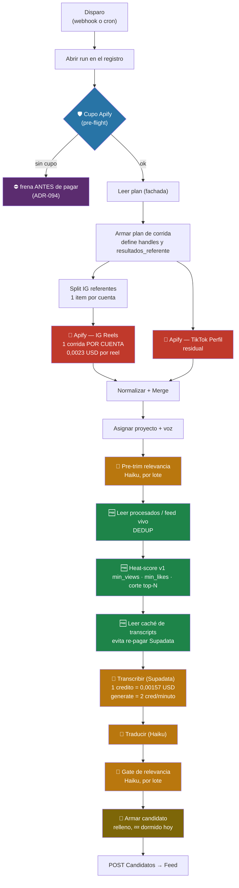

# Costos — la herramienta vista desde la plata

> **Qué es esto.** El único lugar donde se mira el pipeline como gasto: dónde se paga, a quién,
> cuánto, y qué palanca mueve cada número. Nace el **2026-09-10**, el día que Apify se comió la
> mitad del cupo mensual en 21 horas.
>
> 🔑 **La regla que gobierna todo el doc: un costo no se cita, se mide.** Cada número de acá tiene
> al lado el comando que lo reproduce. Los que no se pudieron medir están marcados ⚠️ y dicen por
> qué. *Un doc de costos con cifras de hace un mes es peor que no tenerlo: da la sensación de saber.*

**Docs hermanos:** el diagnóstico y el plan de ataque viven en
[plan-costo-apify.md](agents/plan-costo-apify.md) — este doc es el **mapa**, aquel es el **plan**.
El norte del producto está en [ROADMAP §1](../ROADMAP.md) y la métrica única en
[ADR-089](adr/ADR-089-una-sola-metrica-aprobados-contra-lo-pedido.md).

---

## 1. Los tres proveedores

| proveedor | qué compra | precio | modelo de cobro | tope | ¿se puede consultar el saldo? |
|---|---|---|---|---|---|
| **Apify** | reels de Instagram y TikTok | 0,0023 USD / reel | pay-per-event, **lineal** | **50 USD/mes** | ✅ `GET /v2/users/me/limits` |
| **Supadata** (plan **Mega**) | transcripción de audio a texto | **0,001567 USD / crédito** | por crédito, según operación | **47 USD/mes = 30.000 créditos** | ❌ **no hay endpoint** (probados `/v1/account`, `/v1/usage`, `/v1/limits` → 404) |
| **Anthropic** (`claude-haiku-4-5`) | juicio de relevancia y traducción | 0,004 / lote · 0,005 / traducción | por llamada | pago por uso, **sin tope** | ⚠️ no consultado desde el repo |

Las tarifas viven en **`app.tarifas`** y las consume la vista `app.v_costos_semana` (ADR-052).

⚠️ **`app.tarifas` no se actualiza desde el 2026-07-20 — 52 días — y una de sus 8 filas está mal por
5,7×** (§1.2). Es un modelo, no la factura.

✅ **La de Apify sí está calibrada y se verificó cruzada:** la exec 182 reporta `apify_ig = 2610`,
que × 0,0023 da **6,008 USD**, y la factura real de Apify en esa misma ventana fue **6,00 USD**.
*Es la única tarifa verificada contra el proveedor.*

### 1.1 Apify — el 96 % del costo de una corrida

- Actor: **`apify/instagram-scraper`** (`shu8hvrXbJbY3Eb9W`), oficial, `PAY_PER_EVENT`.
- **Se paga por reel devuelto, sin descuento por volumen.** No hay tramos.
- El actor de TikTok (`clockworks/free-tiktok-scraper`) es residual: **0,20 USD en toda la historia**.
- 🩸 **El pipeline y las sesiones de agente comparten UNA cuenta con UN tope.** El 09/09 dos
  corridas `origin: MCP` (exploración con agente) gastaron **12,30 USD** de los 50. Apify marca el
  origen, así que la atribución se puede hacer — pero el tope es uno solo, y el que se quede sin
  cupo primero mata al otro. **Separarlo sigue siendo decisión pendiente de Mani** (§8.2).
- 🛡️ Tiene **pre-flight de cupo** (`Cupo Apify (pre-flight)`, ADR-094 capa 1): lee el saldo antes de
  colectar y frena la corrida si no alcanza. **Fail-open a propósito**: si la API no contesta, no
  frena.

### 1.2 Supadata — NO es un problema de costo, y la tarifa del repo miente 5,7×

**Plan Mega: 30.000 créditos por 47 USD/mes** (rate limit 50 req/s). El cobro es **por crédito, y
el número de créditos depende de la operación**:

| operación | créditos | USD | ¿la usamos? |
|---|---|---|---|
| `mode=auto` — leer el transcript que ya existe | **1** | **0,001567** | ✅ el camino normal |
| `mode=generate` — transcribir con IA | **2 por MINUTO de video** | ~0,0031–0,0047 por reel de 40-90 s | ✅ sólo como reintento (ADR-095) |
| traducción de transcript | **30 por minuto** | ~0,047 / min | ❌ **y que siga así** |

🩸 **`app.tarifas` dice `supadata = 0,009 USD por video transcrito`, y eso es 5,7× el precio real de
un `auto` y ~2× el de un `generate`.** No corresponde a ningún tramo del pricing actual. Por eso
todo lo que la vista `v_costos_semana` reporta de Supadata está inflado, y con él su participación
en el total (§3.1).

**Lo que las cifras reales dicen:** 3.589 videos transcritos en **toda la historia del proyecto** ≈
3.589 créditos ≈ **5,63 USD**. Contra un cupo de **30.000 créditos POR MES**, o sea que el proyecto
entero lleva consumido el **12 % de un solo mes**. **Supadata no es una restricción hoy y no está
cerca de serlo.**

⚠️ **La que sí hay que vigilar es `generate`, porque cobra por MINUTO y no por video.** Un reel de
90 s cuesta 3 créditos; una corrida que dispare `generate` sobre 300 videos largos gasta ~900. Sigue
siendo barato, pero es la única línea de Supadata que escala con el largo del contenido.

⛔ **Y la regla que sale de la tabla: la traducción NUNCA se mueve a Supadata.** A 30 créditos por
minuto sale ~30× un `auto`. Hoy traduce Haiku y así se queda.

- ❌ **No hay forma programática de saber cuánto queda.** No se le puede poner el pre-flight que
  tiene Apify. Si se agota, el fallo llega como rechazo por video, no como aviso de saldo.
  **Mitigación disponible sin API:** el repo puede contar sus propios créditos, porque conoce el
  modo de cada transcripción (`app.transcripciones.modo`) y desde la `039` también la duración
  (`duracion_seg`). `count(auto) + 2 × ceil(duracion_seg/60) para generate` es el consumo estimado
  del mes, y no necesita que Supadata lo exponga.
- ✅ Tiene **caché** (`app.cache_transcripts`, ADR-087): un video ya transcrito no se vuelve a
  pagar. Es la única defensa de costo real que existe aguas abajo de Apify.
- ⚠️ El caché tiene un agujero conocido y ya arreglado a medias: un `generate` que **pierde** no
  dejaba marca, así que el video se re-pagaba en cada corrida para siempre. Lo cierra la migración
  `042` con el valor `auto_tras_generate` (ADR-095 §Enmienda 3).

### 1.3 Anthropic (Haiku) — el 18,8 % corregido, repartido en cuatro nodos, y el único sin tope

| nodo | qué hace | tarifa | ¿activo hoy? |
|---|---|---|---|
| `Pre-trim relevancia` | descarta lo obviamente irrelevante antes de transcribir | `haiku_lote` | ✅ el más caro de los cuatro (36-50 lotes/corrida) |
| `Gate de relevancia` | el juicio final de relevancia | `haiku_lote` | ✅ 2 lotes/corrida |
| `Traducir (Claude Haiku)` | guion a español | `haiku_traduccion` | ✅ 1-6/corrida |
| `Armar candidato` | el escalón de **relleno** (ADR-088): re-juzga para completar N | `haiku_lote` | 💤 **`segunda_oportunidad = 0` en las 4 corridas del 10/09** |

**El cuarto está dormido pero no apagado.** Si el supply sube, se despierta y suma costo sin que
nadie lo haya prendido. Es fail-open duro por diseño (invariante #1 de PLAN §2.5).

🩸 **Es el único proveedor de los tres SIN tope**, así que es el único que no se frena solo: Apify
tiene cupo y pre-flight, Supadata tiene cupo (aunque no consultable), y Anthropic simplemente
sigue cobrando. **Y con la corrección de §3.1 pasó a ser el segundo del ranking (18,8 %), por
delante de Supadata** — un lugar que nadie le había mirado porque la tarifa inflada de Supadata lo
tapaba.

---

## 2. Dónde se paga — el mapa



🔑 **Lo que el diagrama hace obvio, y es la tesis de todo este doc: los tres nodos verdes —dedup,
`min_views`, caché— están AGUAS ABAJO del rojo.** Filtran cosas que ya se pagaron. Ninguno de los
tres baja la factura de Apify **ni un centavo**: mejoran la calidad de lo que sigue y ahorran
Supadata y Haiku, que juntos son el 4 % del costo de una corrida.

**Sólo dos cosas deciden lo que se le paga a Apify, y las dos viven en `Armar plan de corrida`:**

```
costo_apify = (handles distintos) × (resultados_referente) × 0,0023
```

...acotado por `onlyPostsNewerThan` (= `dias_recencia`), **el único filtro que corre del lado de
Apify y por lo tanto el único que evita el cobro en vez de descartarlo después**.

---

## 3. Lo medido

### 3.1 Histórico por servicio (`app.v_costos_semana`, toda la historia)

| servicio | unidades | USD según la vista | **USD corregido** | **% corregido** | tarifa |
|---|---|---|---|---|---|
| **apify_ig** | 26.663 | 61,32 | **61,32** | **73,9 %** | ✅ verificada |
| haiku_traduccion | 2.507 | 12,55 | 12,55 | 15,1 % | ⚠️ sin cruzar |
| **supadata** | 3.589 | ~~32,30~~ | **5,62** | **6,8 %** | 🩸 **inflada 5,7×** |
| haiku_lote | 764 | 3,08 | 3,08 | 3,7 % | ⚠️ sin cruzar |
| apify_tt | 36 | 0,20 | 0,20 | 0,2 % | |
| detalle_sugeridos (descubrimiento) | 80 | 0,19 | 0,19 | 0,2 % | |
| perfiles_semilla (descubrimiento) | 29 | 0,07 | 0,07 | 0,1 % | |
| **TOTAL** | | ~~109,71~~ | **83,03** | | |

🩸 **La columna "según la vista" es la que devuelve `v_costos_semana` hoy, y sobreestima el total en
27 USD** por la tarifa de Supadata (§1.2). **La corrección empuja a Apify de 55,9 % a 73,9 %:
concentra el problema, no lo diluye.** *La cifra equivocada hacía ver a Supadata como el segundo
frente de costo cuando es el tercero y está a 12 % de un solo mes de su cupo.*

⚠️ **Además, la vista entera es una ESTIMACIÓN, no la factura**, por dos motivos independientes:
1. Se construye de `runs.metricas × app.tarifas`, así que **no ve** las corridas cuyas métricas
   nunca se escribieron: la exec 178 murió en el gate, gastó 4,09 USD reales y aporta **cero**; la
   exec 183 terminó bien, gastó 1,04 y también aporta cero (§7).
2. Sólo una de las cuatro tarifas está verificada contra el proveedor.

**La factura de verdad es `GET /v2/users/me/limits` para Apify, y no existe para los otros dos.**

### 3.2 La escalada semanal

| semana | USD |
|---|---|
| 2026-07-20 | 4,63 |
| 2026-07-27 | 6,22 |
| 2026-08-03 | 6,14 |
| 2026-08-10 | 0,57 |
| 2026-08-17 | 0,71 |
| 2026-08-24 | **14,83** |
| 2026-08-31 | **35,91** |
| 2026-09-07 | **38,90** |

**Las últimas tres semanas son 89,64 de los 109,71 de toda la historia: el 82 %.** No es una
tendencia, es un salto, y coincide con que `resultados_referente` subiera a 150 y `dias_recencia`
a 200.

### 3.3 Por corrida, por proveedor (10/09)

| exec | apify | supadata | haiku | **TOTAL** | % apify | entregados | **USD/entregado** |
|---|---|---|---|---|---|---|---|
| 176 | 4,012 | 0,090 | 0,187 | 4,289 | 93,5 % | 7 | $0,61 |
| 177 | 4,012 | 0,063 | 0,182 | 4,257 | 94,2 % | 6 | $0,71 |
| 178 | ~4,09 | — | — | ~4,09 | 100 % | **0** (murió en gate) | **∞** |
| 181 | 5,808 | 0,072 | 0,230 | 6,110 | 95,1 % | 6 | $1,02 |
| 182 | 6,008 | 0,045 | 0,213 | 6,266 | 95,9 % | **1** | **$6,27** |
| **183** (post-arreglo) | **1,042** | ~0,027 | ~0,03 | **~1,10** | ~95 % | **0** | **∞** |

**Apify es el 94-96 % de cada corrida.** Optimizar Supadata o Haiku es mover el 4 %.

### 3.3.1 La corrida 183 — el control, y qué probó

Disparada el 10/09 21:43 UTC con `dias_recencia = 50`, `resultados_referente = 25`,
`min_views = 500.000`, 2 proyectos, 24 handles.

| qué | predicción commiteada 21:42 | modelo deduplicado (§4) | **medido** |
|---|---|---|---|
| costo Apify | 1,20 – 2,00 USD | **1,02 USD** | **1,042 USD** ✅ |
| reels colectados | 500 – 750 | **442** | **~453** (derivado de 1,042 / 0,0023) |
| entregados | 0 – 2 | 0 | **0** ✅ |

**Veredicto: el modelo deduplicado ganó y la predicción commiteada perdió.** El costo real cayó
**por debajo** del rango que se había escrito, y los reels también. *El error de dedup de 59 % que
se corrigió en §4.2 se había propagado como una sobreestimación de 15-30 % en la predicción. Un pool
mal contado no falla ruidoso: falla como un presupuesto que sobra.*

**Los dos hechos que la corrida deja probados:**

1. ✅ **El ahorro es real y medido: 6,00 → 1,04 USD, un 83 % menos**, con la misma cantidad de
   proyectos, referentes y N pedido.
2. ⛔ **Y la entrega es cero.** 600 reels comprados, 3 llegaron a transcribirse, **0 candidatos, 0
   descartes.** Que es exactamente lo que §4.1 predijo: con el piso en 500.000 y ventana de 50 días
   el pool entero son 5 videos, y el gate los mata.

**Esto no invalida el ahorro: confirma que costo y entrega estaban atados por el lugar equivocado.**
Bajar el costo 83 % no rompió nada que estuviera funcionando — la corrida anterior entregaba 1 video
por 6 USD. **Lo que falta ahora es bajar `min_views`, que es gratis** (invariante 2).

### 3.4 El embudo: lo que se paga contra lo que se entrega

Exec 182, la peor: **2.610 reels pagados → 1 entregado.** Desglose de `filtrados_por_motivo`:

| etapa | cuántos mueren | ¿ya estaban pagados? |
|---|---|---|
| colectados de Apify | 2.610 | 💸 **sí, los 2.610** |
| `min_views` (piso 500.000) | −1.545 (59 %) | sí |
| dedup (`processed_items`) | −329 | sí |
| pre-trim + gate | −735 | sí |
| **entregados** | **1** | |

**El 10/09, entre las 4 corridas: ~6.875 reels pagados → 13 entregados → 1,97 USD por video.**
Y **11 de esos 13 entraron por `bajo_umbral_entregados`**, o sea que reprobaron relevancia y se
entregaron igual para llenar N.

---

## 4. La tabla de decisión — cada celda con su costo

Pool deduplicado de las 21 cuentas de trading de Vieira, `resultados_referente = 25`, actor actual.
**Cada celda: cuántos videos sobreviven el umbral · cuánto sale cada uno de esos.**

| ventana | reels pagados | **USD/corrida** | ≥500k | ≥250k | ≥100k | ≥50k |
|---|---|---|---|---|---|---|
| 7d | 226 | **0,52** | 1 · $0,52/vid | 3 · $0,17 | 8 · $0,06 | 31 · $0,02 |
| 14d | 311 | **0,72** | 2 · $0,36/vid | 7 · $0,10 | 18 · $0,04 | 47 · $0,02 |
| 30d | 404 | **0,93** | 4 · $0,23/vid | 15 · $0,06 | 39 · $0,02 | 82 · $0,01 |
| **50d ← config actual** | 442 | **1,02** | **5 · $0,20/vid** | 16 · $0,06 | **45 · $0,02** | 99 · $0,01 |
| 100d | 495 | **1,14** | 5 · $0,23/vid | 16 · $0,07 | 59 · $0,02 | 117 · $0,01 |
| 200d | 515 | **1,18** | 10 · $0,12/vid | 28 · $0,04 | 73 · $0,02 | 139 · $0,01 |

Con `resultados_referente = 150` (config vieja) la fila de 200d cuesta **5,45 USD**. La exec 182
costó **6,00**. El modelo predice la factura.

🔑 **Tres lecturas que en prosa no se veían:**

1. **El costo no depende de la columna.** `min_views` no mueve un centavo: filtra después de pagar.
   **Elegir umbral es gratis; elegir ventana es lo que se paga.**
2. **500k cuesta 10-30× más por video usable que 100k**, en cualquier fila.
3. 🙃 **Contra la intuición: con umbral alto, la ventana LARGA sale más barata por video** (0,12 en
   200d contra 0,20 en 50d contra 0,52 en 7d), porque los reels viejos ya acumularon vistas.
   **La peor celda de la tabla es ventana corta + umbral alto.**

### 4.1 Cuánto costaría llenar N de verdad

Los 2 proyectos de Vieira piden **N = 70** y comparten **24 handles distintos** (23 de 24 son
comunes a los dos). Con `resultados_referente = 25` se compran **600 reels = 8,6 reels por video
pedido**.

| umbral | % que pasa | reels a comprar para que 70 pasen | costo |
|---|---|---|---|
| **500.000 (hoy)** | 1,1 % | **6.360** | **$14,63** |
| 250.000 | 3,6 % | 1.944 | $4,47 |
| **100.000** | **10,2 %** | **686** | **$1,58** |
| 50.000 | 22,4 % | 313 | $0,72 |

**Y eso es sólo para pasar `min_views`; el gate mata la mayoría de lo que sobrevive.**

⛔ **Conclusión aritmética: con el piso en 500.000, llenar N=70 no cierra a ningún presupuesto
razonable.** No es que la corrida sea cara: es que se le piden 70 videos a un embudo cuyo primer
filtro deja pasar 5. Las salidas son **bajar el piso** o **bajar el N**.

### 4.2 Por qué el pool de trading es distinto

| pool | reels únicos | mediana de vistas | % ≥ 500k |
|---|---|---|---|
| cuentas de trading (Vieira) | 2.400 | **22.394** | **2,4 %** |
| resto (psicología, comunicación) | 481 | **256.556** | 33,5 % |

**11,5× de diferencia entre medianas.** `min_views` es **global** (`app.ajustes` tiene
`instance_id`, no `proyecto_id`), así que el mismo número gobierna los dos mundos. Es la causa
raíz de que trading no entregue.

⚠️ **Las medianas de ventana larga exageran:** `braidenshaw` tiene mediana 162k sobre 125 reels de
200 días, pero **en sus últimos 11 reels la mediana es 63k y ninguno llega a 500k**. Las vistas se
acumulan. **Para hablar de "qué tan viral es una cuenta" hay que usar ventana corta.**

### 4.3 El tercer eje: el REPARTO entre referentes

La tabla de §4 mueve **ventana** y **umbral**. Falta el eje que gobierna la otra mitad de la
fórmula: cómo se reparte el presupuesto entre las cuentas. La pregunta concreta que lo abrió
(Mani, 10/09): *¿bajar `resultados_referente` a 15-20 y subir mucho la cantidad y la calidad de
referentes?*

**Todo lo de acá se midió leyendo los datasets de Apify de corridas que ya se pagaron, que es
gratis** (§8.5). Ninguna medición de esta sección gastó un centavo.

#### 4.3.1 No hay costo fijo por corrida — medido, y cambia la fórmula

El motor abre **una corrida de Apify por cuenta** (`Split IG referentes`), así que la sospecha
razonable es que cada referente traiga un costo de arranque. **No lo trae.** Las 24 corridas de la
exec 183, divididas por 0,0023:

| reels devueltos | 1 | 3 | 5 | 13 | 25 |
|---|---|---|---|---|---|
| `usageTotalUsd / 0,0023` | **1,000** | **3,000** | **5,000** | **13,000** | **25,000** |

Exacto, sin intercepto. Y el actor declara **un solo evento de cobro** (`result`) en su
`pricingInfos`. ⇒

```
costo = 0,0023 × Σ_cuenta  min( resultados_referente , publicaciones_dentro_de_la_ventana )
```

🔑 **Un referente no cuesta nada por existir: cuesta por cada reel que devuelve.** El término
constante no existe, y de ahí sale el corolario incómodo:

⛔ **24 referentes × 25 resultados y 40 × 15 cuestan EXACTAMENTE lo mismo** (600 reels, 1,38 USD).
Redistribuir a presupuesto constante **no ahorra un centavo**. Lo único que cambia es *cuáles*
reels se compran — y ahí sí hay una diferencia enorme, pero no va en la dirección que uno espera
(§4.3.2).

🩸 **Una cuenta que devuelve CERO reels igual cobra un `result`** (el stub del perfil). En la 183
fueron 4 — `tori.trades`, `thetradingchannel`, `lorenzocorradofx`, `kaycapitals` — a 0,0023 cada
una. Son 0,0092 USD, o sea nada; se anota porque prueba que la unidad de cobro es *el ítem
devuelto*, no *el reel*. **Y porque son 4, no 3**, que es lo que decía §7.

#### 4.3.2 La profundidad NO es un eje de eficiencia — medido hasta 150

**Dentro de la exec 183** (cap 25, 17 cuentas topeadas), tasa de reels con ≥100k vistas por tramo
de recencia, 1 = el más nuevo:

| tramo | comprados | ≥100k | tasa | edad mediana |
|---|---|---|---|---|
| 1-5 | 75 | 2 | **2,7 %** | 2 días |
| 6-10 | 75 | 5 | 6,7 % | 6 días |
| 11-15 | 75 | 8 | 10,7 % | 12 días |
| 16-20 | 75 | 8 | 10,7 % | 16 días |
| **21-25** | 73 | 21 | **28,8 %** | 22 días |

**Los últimos 5 reels que se compran de cada cuenta son ~11× más productivos que los primeros 5.**
No es un artefacto de `braidenshaw` (la mejor cuenta): sacándola, la curva va de **1,4 % a 25,0 %**.

**Y sigue así mucho más abajo.** La exec 182 corrió con cap 150 sobre 30 cuentas, así que la curva
se puede extender gratis:

| tramo | comprados | ≥100k | tasa | edad mediana |
|---|---|---|---|---|
| 1-25 | 569 | 70 | 12,3 % | 12 d |
| 26-50 | 483 | 72 | 14,9 % | 39 d |
| 51-75 | 450 | 63 | 14,0 % | 70 d |
| 76-100 | 431 | 66 | 15,3 % | 85 d |
| 101-125 | 372 | 64 | 17,2 % | 93 d |
| 126-150 | 302 | 54 | **17,9 %** | 110 d |

Acumulado, que es lo que decide: **si el cap fuera K, cuánto sale cada reel útil**

| cap | reels | útiles | USD | **USD/útil** |
|---|---|---|---|---|
| 25 | 569 | 70 | 1,31 | **0,0187** |
| 50 | 1.052 | 142 | 2,42 | 0,0170 |
| 100 | 1.933 | 271 | 4,45 | 0,0164 |
| **150** | 2.607 | 389 | 6,00 | **0,0154** |

🔑 **`resultados_referente` es un knob de VOLUMEN, no de eficiencia.** Bajarlo baja el gasto y el
supply casi en la misma proporción — y encima recorta el tramo *más* productivo, así que el costo
por reel útil **sube** un 21 % al pasar de 150 a 25. Es literalmente lo que hizo la corrida 183:
**−83 % de costo, −100 % de entrega.** No fue mala suerte: es lo que hace un knob de volumen.

⛔ **Por eso bajar a 15 o 20 es la palanca equivocada para lo que se quiere.** Baja la factura, sí,
igual que apagar el motor. Lo que no hace es entregar más por dólar.

⚠️ **El mecanismo es la maduración, y eso hace que la curva dependa de la métrica.** Los reels del
tramo 21-25 tienen 22 días y los del 1-5 tienen 2: no son mejores, tuvieron más tiempo. Con una
métrica de **velocidad** (vistas/día) el orden se da vuelta exacto — 52,0 % en el tramo 1-5 contra
17,8 % en el 21-25. Y con una **relativa** (≥2× la mediana de la propia cuenta) se mantiene la
dirección de las vistas absolutas (12,0 % → 41,1 %), así que no es puro artefacto del umbral.
**La forma de esta curva la fija la métrica de "útil", y la de hoy (`min_views`, absoluta) premia
lo viejo por construcción.** Es la versión intra-cuenta del invariante 3.

#### 4.3.3 Dónde SÍ está la eficiencia: el referente

Misma corrida, mismo umbral, mismos 25 reels comprados a casi todos. **El rango va de 60 % a 0 %:**

| cuenta | reels | ≥100k | USD por reel útil |
|---|---|---|---|
| `braidenshaw` | 25 | **15** | **0,0038** |
| `swingtradinglab` | 13 | 8 | 0,0037 |
| `andreacimi.trading` | 15 | 6 | 0,0058 |
| `julias.algos` | 25 | 5 | 0,0115 |
| `krosh.ivan` · `casper_smc` · `joovier_` | 25 c/u | 4 c/u | 0,0144 |
| … | | | |
| `nicholascrown` · `abeteddymaruta` | 25 c/u | 1 c/u | 0,0575 |
| 🔴 `therobinritter` · `eliteoptionstrader2` · `chart__tactix` · `20mintrader` · `worldclassedge` | **109** | **0** | **∞** |

**5 cuentas se llevan el 24 % del gasto de cada corrida (0,251 USD) y devuelven cero.**

| | reels | USD | útiles | USD/útil |
|---|---|---|---|---|
| corrida 183 como está | 446 | 1,035 | 66 | **0,0155** |
| las mismas cuentas menos esas 5 | 337 | 0,775 | **66** | **0,0117** |

**−24 % de costo sin perder un solo reel útil.** Contra el ±5 % que mueve todo el eje de
profundidad (§4.3.2), **el reparto entre cuentas es el eje que importa, y la variable no es cuántos
referentes hay sino cuáles.**

🩸 **Y esto corrige la lista de poda de §7, que estaba armada por MEDIANA de vistas.** La mediana
es el estadístico equivocado para un proceso de cola pesada: mide dónde está el centro, y acá lo
único que se cobra es la cola.

| cuenta | mediana | útiles ≥100k | veredicto §7 (por mediana) | veredicto medido |
|---|---|---|---|---|
| `_abtrades` | **127** | **2** (uno de 1,2 M) | podar | 🟢 **dejar** |
| `joovier_` | 26.978 | 4 | podar | 🟢 **dejar** |
| `sakeembradley` | 5.937 | 3 | podar | 🟢 dejar |
| `chart__tactix` | 19.498 | **0** | *no figuraba* | 🔴 **podar** |
| `worldclassedge` | 28.014 | **0** | *no figuraba* | 🔴 **podar** |

**La lista vieja mandaba podar dos cuentas que producen y dejaba dos que no.**

#### 4.3.4 Un referente no es una compra: es una suscripción

Un referente topeado cuesta **0,0575 USD por corrida, produzca o no**. A cadencia semanal son
**2,99 USD/año cada uno**. Eso convierte la pregunta *"¿subimos mucho los referentes?"* en una
tabla, con el tope de Apify (50 USD/mes) marcado con `!`:

**USD/mes = referentes × resultados × 0,0023 × 4,3 corridas** *(cota superior: supone que todas
topean; las que publican poco cuestan menos)*

| referentes ↓ / resultados → | 10 | 15 | 25 | 50 | 100 |
|---|---|---|---|---|---|
| 24 *(hoy)* | 2,4 | 3,6 | **5,9** | 11,9 | 23,7 |
| 50 | 4,9 | 7,4 | 12,4 | 24,7 | 49,4 |
| 100 | 9,9 | 14,8 | 24,7 | 49,4 | 98,9 `!` |
| 200 | 19,8 | 29,7 | **49,4** | 98,9 `!` | 197,8 `!` |
| 300 | 29,7 | 44,5 | 74,2 `!` | 148,3 `!` | 296,7 `!` |

🔑 **Subir referentes es viable y la tabla dice cuánto cuesta: 200 referentes a profundidad 25 son
49,4 USD/mes, o sea el cupo entero, sin margen para una sola exploración con agente** (§1.1). Y la
celda que parece la salida — 200 × 10 por 19,8 USD — compra **sólo la cabeza de cada cuenta, el
tramo del 2,7 %** (§4.3.2). *La combinación "muchos referentes, poca profundidad" es la esquina
barata de la tabla y la peor por dólar entregado.*

#### 4.3.5 El desperdicio de verdad: cada corrida re-compra lo de la anterior

Solape de ids entre corridas consecutivas del 10/09, medido sobre los datasets:

| corrida | reels | ya comprados en la anterior | **plata re-pagada** |
|---|---|---|---|
| 16:05 (exec 181) | 2.520 | 1.736 (68,9 %) | 3,99 USD |
| 17:17 (exec 182) | 2.607 | 2.454 (**94,1 %**) | 5,64 USD |
| 21:43 (exec 183) | 450 | 441 (**98,0 %**) | 1,01 USD |

**De los ~25 USD que Apify cobró el 10/09, alrededor de 1 USD compró contenido que el sistema no
tenía.** Con la cadencia semanal y ventana de 50 días la cuenta estructural es la misma: se
re-compra **~86 %** (43 de 50 días) en cada corrida.

🩸 **Y el dedup no lo ve.** De los 446 reels de la 183, sólo **22 (4,9 %)** estaban en
`processed_items`, porque ahí se escribe **después** de `min_views`: el repo **no sabe que ya pagó
por lo que descartó**. Es §8.5 dicho por el otro lado — la lista negra no es un registro de compras.

⛔ **Y no se arregla con el actor de hoy.** Verificado en el input schema del build
`ELq02zbb8PB5NDZkO`: sus 8 campos son `resultsType · directUrls · resultsLimit ·
onlyPostsNewerThan · search · searchType · searchLimit · addParentData`. **No existe
`onlyPostsOlderThan`.** `onlyPostsNewerThan` corta por abajo y `resultsLimit` por arriba, así que
**la franja "de 37 a 30 días atrás" no se puede comprar sin comprar todo lo más nuevo también.**
La ventana siempre está anclada a hoy.

Las dos salidas que quedan:
- **(a) `dias_recencia` ≈ intervalo entre corridas.** Con cadencia semanal, ventana de 7-10 días:
  el solape se va a ~0 y el costo cae a ~219 reels/corrida (0,50 USD) medido sobre el ritmo real de
  publicación de las 24 cuentas. **Precio:** compra reels de 2-7 días, que es el tramo del 2,7 %.
- **(b) Guardar el pool y re-medir selectivo.** Un reel puntual se re-mide por URL a 0,0023
  (`resultsType: posts`, `resultsLimit: 1`) — el motor **ya hace exactamente eso** para
  `videos_meta`. Re-medir 100 borderline sale 0,23 USD contra 1,04 de re-comprar la ventana entera.

⚠️ **`dias_recencia = 50` hoy no hace casi nada, además.** 14 de las 24 cuentas topean en 25 antes
de llegar al día 50, así que para ellas la ventana es un no-op. Y **29 reels (6,5 %) volvieron
igual siendo más viejos que la ventana**, hasta de 989 días: aparecen en las posiciones 1-8 del
dataset y nunca más de 3 por cuenta ⇒ **son los posts FIJADOS de Instagram, que se saltean el
filtro de fecha.** (`apify/instagram-reel-scraper` tiene `skipPinnedPosts`, §6.2.)

#### 4.3.6 Lo que hoy no se puede contestar, y cuesta 0,12 USD contestarlo

**El repo nunca midió el mismo reel dos veces.** Se buscó el par: pool del 31/08-01/09 (1.185 reels,
60 cuentas) contra el del 07-09/09 (6.537 reels, 183 cuentas) ⇒ **0 reels en común**, porque el
roster cambia entero entre corridas de clientes distintos. Todo lo de §4.3.2 es **transversal**
(reels distintos de edades distintas), nunca **longitudinal**.

**El experimento que lo cierra:** re-medir por URL 50 reels frescos de la corrida 183 dentro de 30
días. **50 × 0,0023 = 0,115 USD.** Contesta la única pregunta que decide entre la salida (a) y la
(b): *¿un reel de 2 días que hoy tiene 20k llega a 100k, y en cuánto tiempo?* Si llega, comprar
fresco y esperar es gratis comparado con re-comprar la ventana. Si no llega, el pool viejo es el
producto y la ventana larga se justifica.

#### 4.3.7 Qué hacer, en orden de retorno medido

1. 🟢 **Podar las 5 cuentas de rendimiento cero** (§4.3.3). −24 % del gasto, cero útiles perdidos,
   cuesta borrar links. **Y usar el criterio nuevo: útiles sobre el umbral, no mediana.**
2. 🔴 **No bajar `resultados_referente`.** Si hay que bajar el gasto, se baja **cadencia** o
   **ventana**, que es donde está el 86-98 % de re-compra. La profundidad es lo único que hoy
   compra el tramo productivo.
3. 🟡 **Sumar referentes: sí, con precio en la mano** (§4.3.4) y con la regla de que **un referente
   se audita a las 2 corridas** contra su tasa de útiles. Sin eso, cada cuenta mala entra como una
   suscripción de 3 USD/año que nadie cancela — hoy hay 5 corriendo.
4. ⬜ **El ledger por cuenta**: reels comprados · pasaron `min_views` · candidatos · aprobados, por
   corrida. Es lo que convierte el paso 3 en automático y hoy no existe en ninguna tabla.
5. ⬜ **El experimento de maduración** (§4.3.6), 0,12 USD, antes de rediseñar la ventana.

**Reproducir todo esto:** los ids de corrida salen de `GET /v2/actor-runs?limit=500&desc=1`, los
items de `GET /v2/datasets/<id>/items?fields=id,ownerUsername,videoPlayCount,timestamp`, y ninguna
de las dos cuesta (§9).

---

## 5. Palancas de optimización

| # | palanca | ahorro | costo de hacerlo | estado |
|---|---|---|---|---|
| 0 | `dias_recencia` 200→50 · `resultados_referente` 150→25 | **83 % medido** (6,00 → 1,04) | 2 knobs, cero código | ✅ **10/09** |
| 1 | **Ventana por referente**: `onlyPostsNewerThan` = días desde que se scrapeó ESA cuenta | ⬆️ **86-98 % es re-compra, medido** (§4.3.5) — antes acá decía *~60 %* sin medición | ~10 líneas | ⬜ |
| 2 | **Fórmula proporcional** (§5.1) | reparte, no ahorra — y ⚠️ **repartir a presupuesto constante no ahorra NADA** (§4.3.1): no hay costo fijo por referente | ~15 líneas | ⬜ |
| 3 | **Actor más barato** (§6) | ×0,29 sobre todo lo anterior | bake-off + `n8n:push` | 🔧 1ª prueba hecha |
| 4 | `min_views` **por proyecto** | no ahorra: **arregla el supply** | migración + ADR | ⬜ |
| 5 | Separar cuenta/token de Apify | no ahorra: **evita que una exploración deje sin cupo al motor** | decisión + plata | ⬜ |
| 6 | **Podar por RENDIMIENTO las 5 cuentas de 0 útiles** (§4.3.3) | **−24 % del gasto, 0 útiles perdidos** (medido) | borrar links | ⬜ |
| 8 | **Auditar cada referente a las 2 corridas** contra su tasa de útiles (§4.3.4) | evita que una cuenta mala quede como suscripción de 3 USD/año | el ledger de §4.3.7 | ⬜ |
| 7 | Borrar el proyecto duplicado por la tilde | evita pagar dos veces el mismo criterio | limpieza de datos | ⬜ |

### 5.1 La fórmula proporcional

```js
const resultados_referente = Math.min(
  cap_resultados_referente,
  Math.max(piso_resultados, Math.ceil(presupuesto_reels / Math.max(n_referentes, 1)))
);
```

**El presupuesto se fija en REELS, no en videos entregados.** Un presupuesto en reels **es** el
costo (× 0,0023) y se lee directo; uno en entregados no se puede traducir a plata sin adivinar el
rendimiento del embudo, que hoy es de 529 reels por entregado.

⚠️ **La fórmula sola no baja el gasto: lo reparte mejor.** Lo que lo baja es la palanca 1, la única
que reduce lo que Apify **devuelve y cobra**.

---

## 6. Alternativas de herramienta

### 6.1 Bake-off medido (10/09 21:21 UTC, cuenta `braidenshaw`)

| | `apify/instagram-scraper` (actual) | `instagram-scraper/instagram-profile-reels-scraper` |
|---|---|---|
| costo real | 0,115 / 50 reels = **0,0023 / reel** | **0,0074 / 11 reels = 0,00067 / reel** all-in |
| relación | — | **3,4× más barato** |
| campos del motor | todos | **todos** (`play_count`, `like_count`, `caption`, `url`, `shortcode`, `taken_at`) |
| filtro por fecha | `onlyPostsNewerThan`, gratis | server-side, cobra 0,0004 por descartado |
| entrada | 1 corrida por cuenta | **array → 1 sola corrida** |
| adopción | 12.487 usuarios/mes (oficial) | 248 usuarios/mes |
| tier GOLD | — | baja a 0,00045 / reel |

🎁 **Devuelve `video_duration`**, que hoy falta en 149 de 150 filas de `app.videos_meta` y es lo que
bloquea el aviso de "guion incompleto" de ADR-095.

⛔ **NO aprobado:** se pidieron 25 posts con ventana de 50 días y devolvió **11, todos de los
últimos 11 días**. La semántica de `recent` no es la que dice el nombre. **Falta una segunda prueba
con 2-3 cuentas y fecha ISO.** *Un actor 3,4× más barato que trae un tercio de lo pedido no es más
barato.*

### 6.2 Sin evaluar

- `apify/instagram-reel-scraper` (oficial, mismo precio, pero acepta array y tiene `skipPinnedPosts`).
- **Subir de tier en Apify:** el actor barato cae de 0,00059 (BRONZE) a 0,00045 (GOLD). No se
  calculó si el salto de plan se paga solo.
- Alternativas a Supadata (29 % del histórico y sin forma de ver el saldo).

---

## 7. Pendientes

**Bloqueantes de plata**
- [ ] Decidir `min_views` con el resultado de la corrida 183 (§4.1 dice que 500k no cierra).
- [ ] 2ª prueba del actor barato con fecha ISO (§6.1).
- [ ] Decidir si el motor tiene cuenta/token propio de Apify (§1.1).

**Higiene de datos que cuesta plata**
- [ ] Borrar el proyecto duplicado por la tilde: `Comunicación para lideres` (N=15) vs
      `Comunicación para líderes` (N=20), los dos activos.
- [ ] Revisar las **4** de 24 cuentas de trading que no devolvieron nada — `tori.trades`,
      `thetradingchannel`, `lorenzocorradofx`, `kaycapitals` (¿mal escritas? ¿privadas?).
      *Este renglón decía 3; son 4, y **cada una cobra igual un `result`** por el stub del perfil (§4.3.1).*
- [ ] 🩸 **Podar por RENDIMIENTO, no por mediana** (§4.3.3): `therobinritter`,
      `eliteoptionstrader2`, `chart__tactix`, `20mintrader`, `worldclassedge` — **109 reels,
      0,251 USD por corrida, CERO reels ≥100k medidos.**
      ⚠️ **La lista vieja de este renglón estaba armada por mediana de vistas y mandaba podar dos
      cuentas que SÍ producen** (`joovier_`, 4 útiles; `sakeembradley`, 3) **y no nombraba dos que
      no producen nada** (`chart__tactix`, `worldclassedge`). *La mediana mide dónde está el centro;
      acá sólo se cobra la cola.*
- [ ] **13 de 15 proyectos con `activo = true` no corren porque su voz está apagada.** La pantalla
      dice una cosa y el motor hace otra.

**Instrumentación**
- [ ] 🩸 **Corregir `app.tarifas` para Supadata: dice `0,009 USD/video` y el real es `0,001567
      USD/crédito`** (plan Mega, 30.000 créditos por 47 USD/mes). Y el modelo de una sola tarifa
      plana **no alcanza**, porque `auto` cuesta 1 crédito por video y `generate` cuesta **2 por
      minuto**: la unidad correcta es el crédito, no el video. Mientras no se arregle,
      `v_costos_semana` sobreestima el total en ~27 USD (§3.1).
- [ ] **Cruzar Haiku contra su factura.** Es el **15,1 %** corregido —el segundo del ranking— y está
      sin verificar. El nodo ya recibe `usage` en la respuesta de la API de Anthropic y lo tira;
      loguearlo a `runs.metricas` convierte la estimación en medición sin llamadas extra.
- [ ] 🩸 **El precio viejo de Supadata está en TRES lugares, no en uno.** Además de `app.tarifas`,
      está **hardcodeado en la UI**: `transcribir/pegar-enlaces.tsx` estima `~USD 0.014 por link`
      ("entre Supadata y Haiku"), que arrastra los 0,009 inflados. Con el precio real de 1 crédito
      son ~0,0066. **Es el número que el equipo ve antes de apretar el botón**, así que sobreestima
      el gasto ~2× justo en el momento en que alguien decide si sigue o no. Un pegote de 365 links
      dice 5,11 USD y cuesta ~2,40.
- [ ] **Contador propio de créditos de Supadata**, ya que no hay endpoint: el repo tiene
      `app.transcripciones.modo` y (desde la `039`) `duracion_seg`, así que
      `count(auto) + 2 × ceil(duracion_seg/60)` sobre `generate` da el consumo del mes sin depender
      del proveedor. **Es lo más cerca de un pre-flight que se puede tener ahí.**
- [ ] `v_costos_semana` no ve las corridas que mueren (la 178 gastó 4,09 y aporta 0). Cerrar ese
      agujero o marcarlo en la vista.
- [ ] `metricas.etapa` no sirve para saber en qué va una corrida viva: `Etapa: colecta` cuelga del
      mismo padre que `Split IG referentes` con Y mayor, así que en n8n v1 se escribe **después** de
      toda la rama de colecta.
- [ ] `metricas.llamadas.supadata` está definido como `_distinct(...)` = **videos distintos, no
      llamadas**, así que no sirve para contar costo (viene del cierre 147).
- [ ] 🔴 **El bug que hace que este doc no se pueda mantener solo, y se reprodujo el 10/09 con la
      corrida 183:** n8n reportó `success` y la fila en `runs` quedó `en_curso` con **sólo**
      `metricas.etapa`. **Todas las métricas de costo de esa corrida se perdieron**, así que
      `v_costos_semana` la cuenta como 0 y la única prueba de lo que gastó es la factura de Apify.
      Es el mismo bug que la exec 178 del cierre 145 (aquella la cerró la corrida siguiente, como
      `fallo`) — **ya van 2 de las últimas 6 corridas del motor**. Es la familia de ADR-094 al revés:
      aquella cierra las que mueren; ésta termina **bien** y no se cierra sola.
      ⚠️ **Mientras esto siga abierto, `USD/entregado` —el canario del invariante 5— no se puede
      calcular para las corridas afectadas.**

---

## 8. Invariantes

1. **El costo se decide antes del pago.** Dedup, `min_views`, pre-trim, gate y caché corren todos
   después de que Apify cobró. Optimizar cualquiera de ellos mejora la calidad, no la factura.
2. **Elegir umbral es gratis; elegir ventana es lo que se paga.**
3. **`dias_recencia` y `min_views` están acoplados y se mueven juntos.** Bajar la ventana sube de
   hecho el umbral, porque las vistas se acumulan con el tiempo.
4. **Un pool chico no baja la entrega: la ensucia.** Sin supply, `bajo_umbral_entregados` rellena N
   con lo que reprobó relevancia. "Me entregó un video que era nada" es síntoma de pool chico, no
   de gate malo.
5. **El canario del costo no es el gasto del día: es USD por video entregado.** 25,62 USD suena
   distinto de 1,97 USD/video, y el segundo es el que se compara contra ADR-089.
6. **El cupo no es un estado, es un saldo.** Se re-mide, no se cita.
   **Y cada proveedor tiene el suyo:** Apify 50 USD/mes (consultable), Supadata 47 USD/mes = 30.000
   créditos (NO consultable), Anthropic **sin tope** — que es su propio riesgo: es el único que no
   se frena solo.
7. **La unidad de cobro del proveedor manda sobre la unidad que nos resulta cómoda.** Supadata no
   cobra por video: cobra por crédito, y `generate` cobra por MINUTO. Modelarlo "por video" metió un
   error de 5,7× que hizo ver a Supadata como el segundo frente de costo cuando es el tercero.
8. **Un pool que se llena de varias corridas se deduplica antes de contarlo.** Sin eso cada corrida
   extra parece supply nuevo. Pasó acá, con 59 % de inflación.

9. **No hay costo fijo por corrida ni por referente: la unidad de cobro es el ítem devuelto.**
   Medido (§4.3.1): `usageTotalUsd / 0,0023` da exactamente el número de reels, sin intercepto.
   ⇒ **redistribuir el mismo presupuesto entre más referentes con menos profundidad no ahorra un
   centavo.** Lo único que cambia es *cuáles* reels se compran.
10. **`resultados_referente` es un knob de VOLUMEN; el roster de referentes es el de EFICIENCIA.**
   La profundidad mueve el USD/útil un ±20 % y en la dirección contraria a la intuición (más
   profundo = más barato por útil, §4.3.2). El referente lo mueve entre 0,0038 y ∞. **Bajar la
   profundidad baja el gasto y la entrega juntos: es apagar el motor un poco.**
11. **La ventana está anclada a hoy y no se puede desanclar con este actor.** No existe
   `onlyPostsOlderThan`, así que toda corrida re-compra lo que la anterior ya pagó: **94-98 %
   medido** (§4.3.5). El costo de una corrida no es lo que colecta, es lo que colecta **de nuevo**.

---

## 8.5 Recuperar videos ya pagados sin volver a pagarlos

🔑 **Un reel que murió en `min_views` NO se perdió: sigue en el dataset de Apify de esa corrida, y
leer un dataset propio es GRATIS.** Es la única vía de rescate que existe, porque el repo no guarda
lo que filtra: `app.descartes` sólo recibe la banda borderline del gate, y `processed_items` guarda
`{id, platform}` — es una lista negra, no un backup.

**Medido el 10/09 sobre las corridas de Vieira:** de los **2.627** reels únicos de trading en los
datasets del día, **388 tenían ≥ 100.000 vistas** y **365 no estaban en el Feed**. Se recuperaron
como URLs a costo cero.

⚠️ **Y re-correr el motor NO los habría traído: 245 de los 365 son más viejos que la ventana de 50
días**, así que ni bajando `min_views` los colectaría. **El rescate se hace por el pegote de
Transcribir, no por el motor.**

**Límites del pegote, medidos:** el campo acepta **20.000 caracteres** (`textoPegado`); una URL de
reel son ~41, o sea que **entran ~487 links por pegada** (los 365 ocupan 14.964). El drenado va en
lotes de **64** y el bucle del cliente se llama solo hasta vaciar la cola.

⚠️ **Lo que el rescate NO da:** los links entran con `origen = 'manual'` y quedan como
transcripciones, **no como candidatos calificados en el Feed**. Sirven para trabajar el contenido;
no cuentan para `aprobados / N pedido` (ADR-089).

```bash
# los dataset ids de las corridas de un día, y sus items (ambos GRATIS)
curl -s -H "Authorization: Bearer $APIFY_TOKEN" \
  "https://api.apify.com/v2/acts/shu8hvrXbJbY3Eb9W/runs?limit=200&desc=1"
curl -s -H "Authorization: Bearer $APIFY_TOKEN" \
  "https://api.apify.com/v2/datasets/<datasetId>/items?clean=true&format=jsonl&fields=ownerUsername,videoPlayCount,timestamp,url,shortCode"
```

---

## 9. Cómo re-medir todo esto

```bash
set -a && source .env && set +a

# 1. El saldo real de Apify (la factura, no el modelo)
curl -s -H "Authorization: Bearer $APIFY_TOKEN" \
  https://api.apify.com/v2/users/me/limits | python3 -m json.tool

# 2. Gasto de Apify por día y por origen (API = pipeline, MCP = sesión de agente)
curl -s -H "Authorization: Bearer $APIFY_TOKEN" \
  "https://api.apify.com/v2/actor-runs?limit=500&desc=1"

# 3. El modelo de costos del repo
curl -s -H "apikey: $SUPABASE_SERVICE_ROLE" -H "Authorization: Bearer $SUPABASE_SERVICE_ROLE" \
  -H "Accept-Profile: app" "$SUPABASE_URL/rest/v1/v_costos_semana?select=*"

# 4. Qué está pidiendo la próxima corrida (proyectos, N, referentes, knobs)
curl -s -H "$RUN_PLAN_HEADER_NOMBRE: $RUN_PLAN_HEADER_VALOR" \
  "$DASHBOARD_URL/api/engine/run-plan?ambito=motor&instancia=$N8N_INSTANCE_ID"
```

⚠️ **`POST "$MOTOR_WEBHOOK_URL"` arranca una corrida real y paga.** Ninguno de los 4 comandos de
arriba gasta un centavo. Leer los datasets de Apify de corridas pasadas **tampoco cuesta**, y es de
donde salen las tablas de §4.
