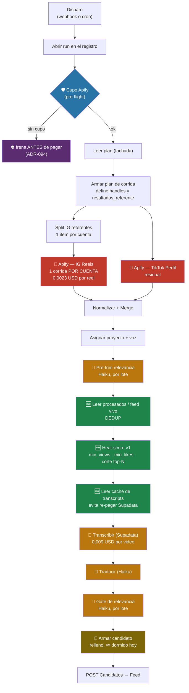

# Costos — la herramienta vista desde la plata

> **Qué es esto.** El único lugar donde se mira el pipeline como gasto: dónde se paga, a quién,
> cuánto, y qué palanca mueve cada número. Nace el **2026-09-10**, el día que Apify se comió la
> mitad del cupo mensual en 21 horas.
>
> 🔑 **La regla que gobierna todo el doc: un costo no se cita, se mide.** Cada número de acá tiene
> al lado el comando que lo reproduce. Los que no se pudieron medir están marcados ⚠️ y dicen por
> qué. *Un doc de costos con cifras de hace un mes es peor que no tenerlo: da la sensación de saber.*

**Docs hermanos:** el diagnóstico y el plan de ataque viven en
[plan-costo-apify.md](agents/plan-costo-apify.md) — este doc es el **mapa**, aquel es el **plan**.
El norte del producto está en [ROADMAP §1](../ROADMAP.md) y la métrica única en
[ADR-089](adr/ADR-089-una-sola-metrica-aprobados-contra-lo-pedido.md).

---

## 1. Los tres proveedores

| proveedor | qué compra | precio | modelo de cobro | tope | ¿se puede consultar el saldo? |
|---|---|---|---|---|---|
| **Apify** | reels de Instagram y TikTok | 0,0023 USD / reel | pay-per-event, **lineal** | **50 USD/mes** | ✅ `GET /v2/users/me/limits` |
| **Supadata** | transcripción de audio a texto | 0,009 USD / video | por video | ⚠️ desconocido | ❌ **no hay endpoint** (probados `/v1/account`, `/v1/usage`, `/v1/limits` → 404) |
| **Anthropic** (`claude-haiku-4-5`) | juicio de relevancia y traducción | 0,004 / lote · 0,005 / traducción | por llamada | pago por uso | ⚠️ no consultado desde el repo |

Las tarifas viven en **`app.tarifas`** y las consume la vista `app.v_costos_semana` (ADR-052).

⚠️ **`app.tarifas` no se actualiza desde el 2026-07-20 — 52 días.** Es un modelo, no la factura.

✅ **Pero el modelo está bien calibrado, al menos para Apify, y se verificó cruzado:** la exec 182
reporta `apify_ig = 2610`, que × 0,0023 da **6,008 USD**, y la factura real de Apify en esa misma
ventana fue **6,00 USD**. *Esa es la única tarifa verificada contra el proveedor. Las de Supadata y
Haiku están sin cruzar.*

### 1.1 Apify — el 96 % del costo de una corrida

- Actor: **`apify/instagram-scraper`** (`shu8hvrXbJbY3Eb9W`), oficial, `PAY_PER_EVENT`.
- **Se paga por reel devuelto, sin descuento por volumen.** No hay tramos.
- El actor de TikTok (`clockworks/free-tiktok-scraper`) es residual: **0,20 USD en toda la historia**.
- 🩸 **El pipeline y las sesiones de agente comparten UNA cuenta con UN tope.** El 09/09 dos
  corridas `origin: MCP` (exploración con agente) gastaron **12,30 USD** de los 50. Apify marca el
  origen, así que la atribución se puede hacer — pero el tope es uno solo, y el que se quede sin
  cupo primero mata al otro. **Separarlo sigue siendo decisión pendiente de Mani** (§8.2).
- 🛡️ Tiene **pre-flight de cupo** (`Cupo Apify (pre-flight)`, ADR-094 capa 1): lee el saldo antes de
  colectar y frena la corrida si no alcanza. **Fail-open a propósito**: si la API no contesta, no
  frena.

### 1.2 Supadata — el 29 % del histórico y el punto ciego

- 3.589 videos transcritos, **32,30 USD** acumulados.
- ❌ **No hay forma programática de saber cuánto queda.** No se le puede poner el pre-flight que
  tiene Apify. Si se agota, el fallo llega como rechazo por video, no como aviso de saldo.
- ✅ Tiene **caché** (`app.cache_transcripts`, ADR-087): un video ya transcrito no se vuelve a
  pagar. Es la única defensa de costo real que existe aguas abajo de Apify.
- ⚠️ El caché tiene un agujero conocido y ya arreglado a medias: un `generate` que **pierde** no
  dejaba marca, así que el video se re-pagaba en cada corrida para siempre. Lo cierra la migración
  `042` con el valor `auto_tras_generate` (ADR-095 §Enmienda 3).

### 1.3 Anthropic (Haiku) — el 14 %, repartido en cuatro nodos

| nodo | qué hace | tarifa | ¿activo hoy? |
|---|---|---|---|
| `Pre-trim relevancia` | descarta lo obviamente irrelevante antes de transcribir | `haiku_lote` | ✅ el más caro de los cuatro (36-50 lotes/corrida) |
| `Gate de relevancia` | el juicio final de relevancia | `haiku_lote` | ✅ 2 lotes/corrida |
| `Traducir (Claude Haiku)` | guion a español | `haiku_traduccion` | ✅ 1-6/corrida |
| `Armar candidato` | el escalón de **relleno** (ADR-088): re-juzga para completar N | `haiku_lote` | 💤 **`segunda_oportunidad = 0` en las 4 corridas del 10/09** |

**El cuarto está dormido pero no apagado.** Si el supply sube, se despierta y suma costo sin que
nadie lo haya prendido. Es fail-open duro por diseño (invariante #1 de PLAN §2.5).

---

## 2. Dónde se paga — el mapa



🔑 **Lo que el diagrama hace obvio, y es la tesis de todo este doc: los tres nodos verdes —dedup,
`min_views`, caché— están AGUAS ABAJO del rojo.** Filtran cosas que ya se pagaron. Ninguno de los
tres baja la factura de Apify **ni un centavo**: mejoran la calidad de lo que sigue y ahorran
Supadata y Haiku, que juntos son el 4 % del costo de una corrida.

**Sólo dos cosas deciden lo que se le paga a Apify, y las dos viven en `Armar plan de corrida`:**

```
costo_apify = (handles distintos) × (resultados_referente) × 0,0023
```

...acotado por `onlyPostsNewerThan` (= `dias_recencia`), **el único filtro que corre del lado de
Apify y por lo tanto el único que evita el cobro en vez de descartarlo después**.

---

## 3. Lo medido

### 3.1 Histórico por servicio (`app.v_costos_semana`, toda la historia)

| servicio | unidades | USD | % |
|---|---|---|---|
| **apify_ig** | 26.663 | **61,32** | **55,9 %** |
| supadata | 3.589 | 32,30 | 29,4 % |
| haiku_traduccion | 2.507 | 12,55 | 11,4 % |
| haiku_lote | 764 | 3,08 | 2,8 % |
| apify_tt | 36 | 0,20 | 0,2 % |
| detalle_sugeridos (descubrimiento) | 80 | 0,19 | 0,2 % |
| perfiles_semilla (descubrimiento) | 29 | 0,07 | 0,1 % |
| **TOTAL** | | **109,71** | |

⚠️ **Esta vista es una ESTIMACIÓN, no la factura.** Se construye de `runs.metricas × app.tarifas`,
así que **no ve** las corridas cuyas métricas nunca se escribieron: la exec 178 murió en el gate,
gastó 4,09 USD reales y aporta **cero** acá. La factura de verdad es
`GET /v2/users/me/limits` para Apify, y no existe para los otros dos.

### 3.2 La escalada semanal

| semana | USD |
|---|---|
| 2026-07-20 | 4,63 |
| 2026-07-27 | 6,22 |
| 2026-08-03 | 6,14 |
| 2026-08-10 | 0,57 |
| 2026-08-17 | 0,71 |
| 2026-08-24 | **14,83** |
| 2026-08-31 | **35,91** |
| 2026-09-07 | **38,90** |

**Las últimas tres semanas son 89,64 de los 109,71 de toda la historia: el 82 %.** No es una
tendencia, es un salto, y coincide con que `resultados_referente` subiera a 150 y `dias_recencia`
a 200.

### 3.3 Por corrida, por proveedor (10/09)

| exec | apify | supadata | haiku | **TOTAL** | % apify | entregados | **USD/entregado** |
|---|---|---|---|---|---|---|---|
| 176 | 4,012 | 0,090 | 0,187 | 4,289 | 93,5 % | 7 | $0,61 |
| 177 | 4,012 | 0,063 | 0,182 | 4,257 | 94,2 % | 6 | $0,71 |
| 178 | ~4,09 | — | — | ~4,09 | 100 % | **0** (murió en gate) | **∞** |
| 181 | 5,808 | 0,072 | 0,230 | 6,110 | 95,1 % | 6 | $1,02 |
| 182 | 6,008 | 0,045 | 0,213 | 6,266 | 95,9 % | **1** | **$6,27** |
| **183** (post-arreglo) | **1,042** | ~0,027 | ~0,03 | **~1,10** | ~95 % | **0** | **∞** |

**Apify es el 94-96 % de cada corrida.** Optimizar Supadata o Haiku es mover el 4 %.

### 3.3.1 La corrida 183 — el control, y qué probó

Disparada el 10/09 21:43 UTC con `dias_recencia = 50`, `resultados_referente = 25`,
`min_views = 500.000`, 2 proyectos, 24 handles.

| qué | predicción commiteada 21:42 | modelo deduplicado (§4) | **medido** |
|---|---|---|---|
| costo Apify | 1,20 – 2,00 USD | **1,02 USD** | **1,042 USD** ✅ |
| reels colectados | 500 – 750 | **442** | **~453** (derivado de 1,042 / 0,0023) |
| entregados | 0 – 2 | 0 | **0** ✅ |

**Veredicto: el modelo deduplicado ganó y la predicción commiteada perdió.** El costo real cayó
**por debajo** del rango que se había escrito, y los reels también. *El error de dedup de 59 % que
se corrigió en §4.2 se había propagado como una sobreestimación de 15-30 % en la predicción. Un pool
mal contado no falla ruidoso: falla como un presupuesto que sobra.*

**Los dos hechos que la corrida deja probados:**

1. ✅ **El ahorro es real y medido: 6,00 → 1,04 USD, un 83 % menos**, con la misma cantidad de
   proyectos, referentes y N pedido.
2. ⛔ **Y la entrega es cero.** 600 reels comprados, 3 llegaron a transcribirse, **0 candidatos, 0
   descartes.** Que es exactamente lo que §4.1 predijo: con el piso en 500.000 y ventana de 50 días
   el pool entero son 5 videos, y el gate los mata.

**Esto no invalida el ahorro: confirma que costo y entrega estaban atados por el lugar equivocado.**
Bajar el costo 83 % no rompió nada que estuviera funcionando — la corrida anterior entregaba 1 video
por 6 USD. **Lo que falta ahora es bajar `min_views`, que es gratis** (invariante 2).

### 3.4 El embudo: lo que se paga contra lo que se entrega

Exec 182, la peor: **2.610 reels pagados → 1 entregado.** Desglose de `filtrados_por_motivo`:

| etapa | cuántos mueren | ¿ya estaban pagados? |
|---|---|---|
| colectados de Apify | 2.610 | 💸 **sí, los 2.610** |
| `min_views` (piso 500.000) | −1.545 (59 %) | sí |
| dedup (`processed_items`) | −329 | sí |
| pre-trim + gate | −735 | sí |
| **entregados** | **1** | |

**El 10/09, entre las 4 corridas: ~6.875 reels pagados → 13 entregados → 1,97 USD por video.**
Y **11 de esos 13 entraron por `bajo_umbral_entregados`**, o sea que reprobaron relevancia y se
entregaron igual para llenar N.

---

## 4. La tabla de decisión — cada celda con su costo

Pool deduplicado de las 21 cuentas de trading de Vieira, `resultados_referente = 25`, actor actual.
**Cada celda: cuántos videos sobreviven el umbral · cuánto sale cada uno de esos.**

| ventana | reels pagados | **USD/corrida** | ≥500k | ≥250k | ≥100k | ≥50k |
|---|---|---|---|---|---|---|
| 7d | 226 | **0,52** | 1 · $0,52/vid | 3 · $0,17 | 8 · $0,06 | 31 · $0,02 |
| 14d | 311 | **0,72** | 2 · $0,36/vid | 7 · $0,10 | 18 · $0,04 | 47 · $0,02 |
| 30d | 404 | **0,93** | 4 · $0,23/vid | 15 · $0,06 | 39 · $0,02 | 82 · $0,01 |
| **50d ← config actual** | 442 | **1,02** | **5 · $0,20/vid** | 16 · $0,06 | **45 · $0,02** | 99 · $0,01 |
| 100d | 495 | **1,14** | 5 · $0,23/vid | 16 · $0,07 | 59 · $0,02 | 117 · $0,01 |
| 200d | 515 | **1,18** | 10 · $0,12/vid | 28 · $0,04 | 73 · $0,02 | 139 · $0,01 |

Con `resultados_referente = 150` (config vieja) la fila de 200d cuesta **5,45 USD**. La exec 182
costó **6,00**. El modelo predice la factura.

🔑 **Tres lecturas que en prosa no se veían:**

1. **El costo no depende de la columna.** `min_views` no mueve un centavo: filtra después de pagar.
   **Elegir umbral es gratis; elegir ventana es lo que se paga.**
2. **500k cuesta 10-30× más por video usable que 100k**, en cualquier fila.
3. 🙃 **Contra la intuición: con umbral alto, la ventana LARGA sale más barata por video** (0,12 en
   200d contra 0,20 en 50d contra 0,52 en 7d), porque los reels viejos ya acumularon vistas.
   **La peor celda de la tabla es ventana corta + umbral alto.**

### 4.1 Cuánto costaría llenar N de verdad

Los 2 proyectos de Vieira piden **N = 70** y comparten **24 handles distintos** (23 de 24 son
comunes a los dos). Con `resultados_referente = 25` se compran **600 reels = 8,6 reels por video
pedido**.

| umbral | % que pasa | reels a comprar para que 70 pasen | costo |
|---|---|---|---|
| **500.000 (hoy)** | 1,1 % | **6.360** | **$14,63** |
| 250.000 | 3,6 % | 1.944 | $4,47 |
| **100.000** | **10,2 %** | **686** | **$1,58** |
| 50.000 | 22,4 % | 313 | $0,72 |

**Y eso es sólo para pasar `min_views`; el gate mata la mayoría de lo que sobrevive.**

⛔ **Conclusión aritmética: con el piso en 500.000, llenar N=70 no cierra a ningún presupuesto
razonable.** No es que la corrida sea cara: es que se le piden 70 videos a un embudo cuyo primer
filtro deja pasar 5. Las salidas son **bajar el piso** o **bajar el N**.

### 4.2 Por qué el pool de trading es distinto

| pool | reels únicos | mediana de vistas | % ≥ 500k |
|---|---|---|---|
| cuentas de trading (Vieira) | 2.400 | **22.394** | **2,4 %** |
| resto (psicología, comunicación) | 481 | **256.556** | 33,5 % |

**11,5× de diferencia entre medianas.** `min_views` es **global** (`app.ajustes` tiene
`instance_id`, no `proyecto_id`), así que el mismo número gobierna los dos mundos. Es la causa
raíz de que trading no entregue.

⚠️ **Las medianas de ventana larga exageran:** `braidenshaw` tiene mediana 162k sobre 125 reels de
200 días, pero **en sus últimos 11 reels la mediana es 63k y ninguno llega a 500k**. Las vistas se
acumulan. **Para hablar de "qué tan viral es una cuenta" hay que usar ventana corta.**

---

## 5. Palancas de optimización

| # | palanca | ahorro | costo de hacerlo | estado |
|---|---|---|---|---|
| 0 | `dias_recencia` 200→50 · `resultados_referente` 150→25 | **83 % medido** (6,00 → 1,04) | 2 knobs, cero código | ✅ **10/09** |
| 1 | **Ventana por referente**: `onlyPostsNewerThan` = días desde que se scrapeó ESA cuenta | ~60 % de lo que quede | ~10 líneas | ⬜ |
| 2 | **Fórmula proporcional** (§5.1) | evita que sumar referentes multiplique el costo | ~15 líneas | ⬜ |
| 3 | **Actor más barato** (§6) | ×0,29 sobre todo lo anterior | bake-off + `n8n:push` | 🔧 1ª prueba hecha |
| 4 | `min_views` **por proyecto** | no ahorra: **arregla el supply** | migración + ADR | ⬜ |
| 5 | Separar cuenta/token de Apify | no ahorra: **evita que una exploración deje sin cupo al motor** | decisión + plata | ⬜ |
| 6 | Podar las 4 cuentas que nunca aportan | ~17 % de los handles | borrar links | ⬜ |
| 7 | Borrar el proyecto duplicado por la tilde | evita pagar dos veces el mismo criterio | limpieza de datos | ⬜ |

### 5.1 La fórmula proporcional

```js
const resultados_referente = Math.min(
  cap_resultados_referente,
  Math.max(piso_resultados, Math.ceil(presupuesto_reels / Math.max(n_referentes, 1)))
);
```

**El presupuesto se fija en REELS, no en videos entregados.** Un presupuesto en reels **es** el
costo (× 0,0023) y se lee directo; uno en entregados no se puede traducir a plata sin adivinar el
rendimiento del embudo, que hoy es de 529 reels por entregado.

⚠️ **La fórmula sola no baja el gasto: lo reparte mejor.** Lo que lo baja es la palanca 1, la única
que reduce lo que Apify **devuelve y cobra**.

---

## 6. Alternativas de herramienta

### 6.1 Bake-off medido (10/09 21:21 UTC, cuenta `braidenshaw`)

| | `apify/instagram-scraper` (actual) | `instagram-scraper/instagram-profile-reels-scraper` |
|---|---|---|
| costo real | 0,115 / 50 reels = **0,0023 / reel** | **0,0074 / 11 reels = 0,00067 / reel** all-in |
| relación | — | **3,4× más barato** |
| campos del motor | todos | **todos** (`play_count`, `like_count`, `caption`, `url`, `shortcode`, `taken_at`) |
| filtro por fecha | `onlyPostsNewerThan`, gratis | server-side, cobra 0,0004 por descartado |
| entrada | 1 corrida por cuenta | **array → 1 sola corrida** |
| adopción | 12.487 usuarios/mes (oficial) | 248 usuarios/mes |
| tier GOLD | — | baja a 0,00045 / reel |

🎁 **Devuelve `video_duration`**, que hoy falta en 149 de 150 filas de `app.videos_meta` y es lo que
bloquea el aviso de "guion incompleto" de ADR-095.

⛔ **NO aprobado:** se pidieron 25 posts con ventana de 50 días y devolvió **11, todos de los
últimos 11 días**. La semántica de `recent` no es la que dice el nombre. **Falta una segunda prueba
con 2-3 cuentas y fecha ISO.** *Un actor 3,4× más barato que trae un tercio de lo pedido no es más
barato.*

### 6.2 Sin evaluar

- `apify/instagram-reel-scraper` (oficial, mismo precio, pero acepta array y tiene `skipPinnedPosts`).
- **Subir de tier en Apify:** el actor barato cae de 0,00059 (BRONZE) a 0,00045 (GOLD). No se
  calculó si el salto de plan se paga solo.
- Alternativas a Supadata (29 % del histórico y sin forma de ver el saldo).

---

## 7. Pendientes

**Bloqueantes de plata**
- [ ] Decidir `min_views` con el resultado de la corrida 183 (§4.1 dice que 500k no cierra).
- [ ] 2ª prueba del actor barato con fecha ISO (§6.1).
- [ ] Decidir si el motor tiene cuenta/token propio de Apify (§1.1).

**Higiene de datos que cuesta plata**
- [ ] Borrar el proyecto duplicado por la tilde: `Comunicación para lideres` (N=15) vs
      `Comunicación para líderes` (N=20), los dos activos.
- [ ] Revisar las 3 de 24 cuentas de trading que no devolvieron nada (¿mal escritas? ¿privadas?).
- [ ] Podar `therobinritter` (mediana 1.695), `eliteoptionstrader2` (3.072), `joovier_` (3.167),
      `sakeembradley` (5.877).
- [ ] **13 de 15 proyectos con `activo = true` no corren porque su voz está apagada.** La pantalla
      dice una cosa y el motor hace otra.

**Instrumentación**
- [ ] Actualizar `app.tarifas` (52 días sin tocar) y **cruzar Supadata y Haiku contra su factura**;
      hoy sólo Apify está verificado.
- [ ] `v_costos_semana` no ve las corridas que mueren (la 178 gastó 4,09 y aporta 0). Cerrar ese
      agujero o marcarlo en la vista.
- [ ] `metricas.etapa` no sirve para saber en qué va una corrida viva: `Etapa: colecta` cuelga del
      mismo padre que `Split IG referentes` con Y mayor, así que en n8n v1 se escribe **después** de
      toda la rama de colecta.
- [ ] `metricas.llamadas.supadata` está definido como `_distinct(...)` = **videos distintos, no
      llamadas**, así que no sirve para contar costo (viene del cierre 147).
- [ ] 🔴 **El bug que hace que este doc no se pueda mantener solo, y se reprodujo el 10/09 con la
      corrida 183:** n8n reportó `success` y la fila en `runs` quedó `en_curso` con **sólo**
      `metricas.etapa`. **Todas las métricas de costo de esa corrida se perdieron**, así que
      `v_costos_semana` la cuenta como 0 y la única prueba de lo que gastó es la factura de Apify.
      Es el mismo bug que la exec 178 del cierre 145 (aquella la cerró la corrida siguiente, como
      `fallo`) — **ya van 2 de las últimas 6 corridas del motor**. Es la familia de ADR-094 al revés:
      aquella cierra las que mueren; ésta termina **bien** y no se cierra sola.
      ⚠️ **Mientras esto siga abierto, `USD/entregado` —el canario del invariante 5— no se puede
      calcular para las corridas afectadas.**

---

## 8. Invariantes

1. **El costo se decide antes del pago.** Dedup, `min_views`, pre-trim, gate y caché corren todos
   después de que Apify cobró. Optimizar cualquiera de ellos mejora la calidad, no la factura.
2. **Elegir umbral es gratis; elegir ventana es lo que se paga.**
3. **`dias_recencia` y `min_views` están acoplados y se mueven juntos.** Bajar la ventana sube de
   hecho el umbral, porque las vistas se acumulan con el tiempo.
4. **Un pool chico no baja la entrega: la ensucia.** Sin supply, `bajo_umbral_entregados` rellena N
   con lo que reprobó relevancia. "Me entregó un video que era nada" es síntoma de pool chico, no
   de gate malo.
5. **El canario del costo no es el gasto del día: es USD por video entregado.** 25,62 USD suena
   distinto de 1,97 USD/video, y el segundo es el que se compara contra ADR-089.
6. **El cupo no es un estado, es un saldo.** Se re-mide, no se cita.
7. **Un pool que se llena de varias corridas se deduplica antes de contarlo.** Sin eso cada corrida
   extra parece supply nuevo. Pasó acá, con 59 % de inflación.

---

## 9. Cómo re-medir todo esto

```bash
set -a && source .env && set +a

# 1. El saldo real de Apify (la factura, no el modelo)
curl -s -H "Authorization: Bearer $APIFY_TOKEN" \
  https://api.apify.com/v2/users/me/limits | python3 -m json.tool

# 2. Gasto de Apify por día y por origen (API = pipeline, MCP = sesión de agente)
curl -s -H "Authorization: Bearer $APIFY_TOKEN" \
  "https://api.apify.com/v2/actor-runs?limit=500&desc=1"

# 3. El modelo de costos del repo
curl -s -H "apikey: $SUPABASE_SERVICE_ROLE" -H "Authorization: Bearer $SUPABASE_SERVICE_ROLE" \
  -H "Accept-Profile: app" "$SUPABASE_URL/rest/v1/v_costos_semana?select=*"

# 4. Qué está pidiendo la próxima corrida (proyectos, N, referentes, knobs)
curl -s -H "$RUN_PLAN_HEADER_NOMBRE: $RUN_PLAN_HEADER_VALOR" \
  "$DASHBOARD_URL/api/engine/run-plan?ambito=motor&instancia=$N8N_INSTANCE_ID"
```

⚠️ **`POST "$MOTOR_WEBHOOK_URL"` arranca una corrida real y paga.** Ninguno de los 4 comandos de
arriba gasta un centavo. Leer los datasets de Apify de corridas pasadas **tampoco cuesta**, y es de
donde salen las tablas de §4.
