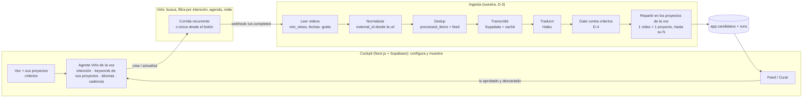

# Parte 2 · Dónde encaja Virlo en la herramienta

*Escrito el 2026-09-28. Toma las capacidades de [01-reunion-y-api.md](./01-reunion-y-api.md) y las
pone contra lo que existe hoy: el motor de n8n (48 nodos, [dev-doc §2](../agents/dev-doc.md)), el
cockpit (Next.js en Vercel + Supabase) y el norte. **Es una propuesta**: las decisiones marcadas
`D-n` las confirma Mani en [00-plan.md §3](./00-plan.md).*

---

## 1. El norte contra el que se mide todo

- **La demanda:** 6 voces (los "~7 clientes") × ~200 guiones al mes ≈ **1.200-1.400 aprobados al
  mes**, o ~300 por semana, repartidos en 28 proyectos (19 activos hoy).
- **La calidad:** videos de **500.000+ vistas** (pedido del jefe) que el equipo apruebe.
- **La métrica:** `aprobados / N pedido` por proyecto y corrida ([ADR-089](../adr/ADR-089-una-sola-metrica-aprobados-contra-lo-pedido.md)).
  Todo lo demás es diagnóstico.
- **El hecho que manda** ([costos.md §4.1.1](../costos.md)): con 500k de piso, el roster de
  referentes da **0,6 a 2,3 aprobados por semana**, y para llenar la demanda harían falta **1.656 a
  6.132 referentes**. *El material no existe dentro del roster.* **Ningún proveedor arregla eso si
  se sigue buscando por cuentas.**

De ahí sale la tesis de todo este plan:

> **Virlo no se adopta como un Apify más caro. Se adopta porque cambia el eje de búsqueda: de
> "qué publicaron estas 78 cuentas" a "qué se volvió viral en este tema, en cualquier cuenta".** Es
> lo único que ataca el techo del roster.

⚠️ **Y eso choca con [ADR-019](../adr/ADR-019-remocion-total-eje-keyword.md)**, que mató la búsqueda
por keyword porque dio **2 aprobables de 60 (3 %)**. La diferencia con lo que se probó en julio es
real (aquella era búsqueda cruda por hashtag de TikTok en Apify; la de Virlo tiene filtro de
intención con IA sobre caption y transcript, refina las keywords y se auto-ajusta), **pero es una
hipótesis, no un hecho**. Por eso la Fase 0 mide exactamente eso antes de construir nada.

---

## 2. Las dos formas de usar Virlo, y por qué una es el carril principal

| | **Carril A · Agentes por voz** | **Carril B · Tracking de referentes** |
|---|---|---|
| Qué busca | Videos del nicho, de cualquier cuenta | Lo que publican las cuentas que el equipo eligió |
| Unidad de costo | 0,50 / 1,50 USD por corrida, traiga 50 o 300 videos | 0,25 USD por cuenta por chequeo |
| Techo | El tamaño del nicho (miles en liderazgo, psicología, trading) | El ritmo de publicación del roster (el techo medido de hoy) |
| Piso de 500k | Filtro **gratis** al leer (`min_views`) | Filtro nuestro |
| Re-medición | Implícita, si el agente vuelve a encontrar el video (a medir) | Explícita: snapshots en cada chequeo |
| Transcript | **Sí** (01/10): gratis al leer; IG solo con Data Intelligence | Solo video tracking (`latest_transcript`) |
| Hoy lo hace | Nadie (murió en ADR-019) | Apify + marca de agua + pool crudo (ADR-100) |
| Costo con 78 referentes semanales | n/a | ~84 USD/mes (Apify hoy: ~5-25) |

**D-1: el Carril A es el principal (un agente por voz, dirección de Mani del 28/09) y el Carril B es opcional.** Argumento: el B
cuesta 3 a 15 veces lo que Apify por hacer lo mismo, y "lo mismo" es justo lo que no alcanza. Si el
equipo quiere seguir a ciertas cuentas sí o sí, el B se reserva para un puñado (10-20 referentes
estrella, 11-22 USD/mes). **Se decide con la Fase 0, no antes.**

---

## 3. La arquitectura objetivo

Tres ideas de diseño:

1. **Una voz tiene un agente de Virlo** (dirección de Mani, 28/09). Los proyectos existen para dar
   variedad dentro de la voz y se pisan entre sí, así que un agente por proyecto compraría varias
   veces los mismos videos. Las 7 a 12 keywords del agente (el autopilot sube a 15) **salen de los
   proyectos de la voz**: cada proyecto aporta uno o dos ángulos. La intención se escribe en el
   formato que recomienda Virlo, con variaciones para elegir. Se guarda en una tabla nueva
   (`app.agentes_virlo`: voz, `agent_id`, idiomas, intención, keywords, excluidas, cadencia, Data
   Intelligence sí/no, activo). Se suma un segundo agente o más corridas **solo si la voz se queda
   corta**.
   **Idiomas:** `english_only: false` deja pasar todo (no existe "todo menos español") y Virlo
   busca en el idioma en que están escritas las keywords. Sin keywords en español casi no entra
   español, y lo que se cuele se descarta gratis con `language_detected`. Si un agente puede mezclar
   keywords de varios idiomas lo mide la Fase 0 (la doc no lo dice).
2. **Los proyectos pasan a ser cajones.** Hoy un video llega por un referente y hay que adivinar a
   qué proyecto va (`Asignar proyecto+voz`, fan-out). Con un agente por voz, el pool de la voz se
   **reparte** entre sus proyectos: el gate ya juzga cada video contra los criterios de cada
   proyecto, y `Armar candidato` ya garantiza "1 video = 1 proyecto, hasta su N". El N de cada
   proyecto deja de decir cuánto buscar y pasa a decir cómo repartir.
3. **El aprendizaje cambia de lugar.** Hoy lo aprobado alimenta `criterios_aprendidos` y el
   heat-score. Con Virlo, lo aprobado y descartado se convierte en **ajustes a la intención y las
   excluidas del agente** (`suggest-keywords` en modo `refresh`, gratis). El agente aprende adentro
   de Virlo y nosotros le damos la señal.

---

## 4. Qué reemplaza, qué absorbe, qué se queda

| Pieza de hoy | Con Virlo | Veredicto |
|---|---|---|
| Dispatcher (cron semanal) | La cadencia del agente recurrente | **Reemplaza** (para el Carril A) |
| Botón Correr (webhook del motor) | Crear un agente de una sola corrida con la intención del proyecto (0,50/1,50 USD) | **Reemplaza**. No existe "correr ahora" sobre un recurrente |
| Single-flight, barrer zombies | Virlo no corre dos veces el mismo agente; cada corrida es independiente | **Muere** en el Carril A |
| `Leer plan (fachada)` | La config sigue viviendo en el cockpit | **Se queda** (lo lee la ingesta) |
| `Apify — IG Reels` / `TikTok Perfil` | Agentes (A) / tracking (B) | **Reemplaza** |
| Marca de agua, `pool_crudo`, re-medir | Virlo guarda y actualiza las métricas | **Absorbe**. `pool_crudo` queda como histórico |
| `Asignar proyecto+voz` | El agente pertenece a la voz; queda repartir entre sus proyectos (el gate ya juzga por proyecto) | **Se simplifica** |
| `Pre-trim relevancia` (Haiku sobre caption) | Filtro de intención de Virlo en cada corrida | **Absorbe** |
| `Heat-score v1` (percentiles + piso) | `min_views` al leer + Virality Score + guardados/compartidos + velocidad ([05 §6](./05-payloads-y-decisiones.md)) | **Se rehace** con datos mejores |
| Señal de selección por referente | Aprendizaje por característica del video (hook, formato, tono), por voz ([05 §2.4](./05-payloads-y-decisiones.md)) | **Se reemplaza** |
| Dedup (`processed_items` + feed vivo) | Nada en Virlo lo hace entre agentes | **Se queda** |
| `Transcribir (Supadata)` + caché | `include_transcript=true` al leer los videos del agente, gratis | **Pasa a respaldo** (D-2, 01/10): solo para lo que llega `null` |
| `Traducir (Haiku)` | Nada | **Se queda** |
| `Gate de relevancia` (Haiku sobre transcript) | `intent_match` con Data Intelligence | **En duda** (D-4) |
| `Armar candidato` (N, dedup, spillover) | Nada | **Se queda** |
| `runs` + métricas + `candidatos` | Nada | **Se queda**, mismo contrato: el Feed no cambia |
| Workflow de descubrimiento de referentes | `creators/outliers` + `similar` del agente | **Absorbe** (si el Carril B existe) |
| Workflow de archivado | Nada (trabaja sobre `candidatos`) | **Se queda** |
| Colecciones: metadata y mp4 por URL (`lib/apify.ts`) | Solo `video-outlier` a 0,50 USD por video (200× Apify) | **Apify se queda** para esto, con saldo chico |
| Pantalla Transcribir (`lib/transcribir.ts`) | Nada por URL suelta | **Supadata se queda** |
| LinkedIn | Virlo no lo cubre | **Fuera de alcance** |

**Lo nuevo que no existe hoy y Virlo trae gratis con cada corrida:** tendencias del nicho con su
estado, reporte de qué funciona y por qué, hooks exactos, cuentas outlier (las "autoridades" que
busca PreWave: cuentas medianas con un video enorme), sonidos. Eso es material para el lado de
tracker del cockpit y para el frente de PreWave (§7).

---

## 5. Las dos preguntas grandes

### 5.1 ¿Se puede reemplazar Supadata? **En el camino principal, sí. Del todo, no.** (D-2)

*Esta sección decía "hoy no" hasta el 01/10, con el argumento de que la API no entregaba el texto.
Virlo contestó que sí, y la doc de ese día lo confirma ([01 §1.4](./01-reunion-y-api.md)).*

- **El transcript viene gratis** al leer los videos del agente (`include_transcript=true`): `text`,
  `segments` con tiempos y `source`.
- **TikTok y YouTube:** ~85 % trae el de la plataforma (`platform`, solo texto). **Instagram:** solo
  en agentes con Data Intelligence, siempre con tiempos, ~40 % de los reels; el resto casi todo es
  sin voz. Por eso D-7 se vuelve obligatoria.
- **La regla de cobertura de ADR-095 sigue valiendo:** con `segments` y `duration` se calcula
  directo. Lo único nuevo es el `platform` sin tiempos, que la Fase 0 compara contra Supadata.
- **Supadata se queda de respaldo:** para los `null` que no son silencio y para las pantallas de URL
  suelta (Transcribir, Colecciones), donde Virlo no tiene nada barato.
- **El ahorro en plata es chico** (3.589 transcripciones en toda la historia ≈ 5,63 USD,
  [costos.md §1.2](../costos.md)). Lo que se gana es un paso menos en el camino principal y no pagar
  dos veces un transcript que Virlo ya hizo para filtrar.
- **A revisar después del piloto:** si el respaldo es chico, bajar de plan en Supadata.

### 5.2 ¿n8n sigue siendo necesario? **Para el carril nuevo, no.** (D-3)

n8n era indispensable porque Apify no trae lógica: había que agendar, repartir por instancia,
colectar, filtrar, asignar, puntuar, cortar. Con Virlo:

- **Agendar** lo hace Virlo (cadencia) y **avisa** por webhook.
- **Filtrar por tema** lo hace Virlo (intención).
- **Asignar** se reduce a repartir entre los proyectos de una misma voz (agente por voz).
- **Lo que queda es ingesta:** leer una lista, deduplicar, transcribir, traducir, (juzgar), cortar
  y escribir. Seis pasos, todos HTTP + JavaScript que ya existe en los code nodes.

**Tres opciones para dónde vive esa ingesta:**

| Opción | A favor | En contra |
|---|---|---|
| **a. Rama Virlo dentro del motor de n8n** (lo que planteó Alejo) | Reusa todo: `n8n:push`, `n8n:diff`, tests de nodos, error handler, `runs`. | Se construye dentro de un workflow de 48 nodos que el carril nuevo mayormente no usa, y después hay que sacarlo. El webhook de Virlo necesita otro trigger. |
| **b. Workflow de n8n nuevo y chico** (`workflow-virlo/`) | Separado del motor viejo; reusa las herramientas de sync; el motor de Apify queda intacto como sombra y rollback. | Sigue habiendo dos lugares para la lógica (n8n + cockpit) y una plataforma más que mantener. |
| **c. Ruta en el cockpit** (`/api/virlo/webhook` + ejecución durable) | Un solo repo, un solo lenguaje con tipos y tests (`node:test` ya corre el dominio). El webhook de Virlo cae directo. n8n queda solo para lo de Apify hasta el corte, y después se puede apagar. | Hay que portar a TypeScript la lógica de transcribir/traducir/cortar, y verificar el límite de duración de funciones del plan de Vercel (con ~50-100 videos por corrida y Supadata en paralelo, son segundos; si no alcanza, Vercel Workflow o una cola). |

**Recomendación: (c)**, con dos argumentos. Uno: el carril nuevo es *empujado por webhook* y ya no
necesita el orquestador, que era lo que n8n aportaba. Dos: construirlo en (a) para después
sacarlo es trabajo doble, y en (c) la sombra sale gratis: el motor de n8n sigue corriendo Apify
**sin un solo cambio**, así que el rollback es no hacer nada. **Apagar n8n entero** (archivado,
descubrimiento, el motor viejo) es una decisión aparte, con su propio ADR, cuando el Carril A haya
ganado.

*Si Mani prefiere (b), el plan funciona igual: cambian los archivos, no las fases.*

---

## 6. El gate: ¿Haiku o `intent_match`? (D-4)

`intent_match` juzga con una frase; nuestro gate juzga con los criterios completos del proyecto +
la voz + lo aprendido, y además sobre el transcript traducido. **No se decide leyendo docs: se
mide.** En la sombra corren los dos sobre los mismos videos y se compara contra lo que el equipo
aprueba. Si `intent_match` acierta igual, el gate muere y con él el Data Intelligence se paga solo
(1 USD por corrida contra Haiku por lote). Si no, el gate se queda y el Data Intelligence se evalúa
solo por los campos extra.

---

## 7. El encaje con PreWave (anotado, no planificado)

Lo que el equipo aprendió de PreWave (nota del vault de Mani,
`02 Projects/30x/notebook/prewave-flujo-produccion-contenido.md`, reunión del 04/09) calza casi uno
a uno con Virlo:

| PreWave | Virlo |
|---|---|
| Buscar "autoridades": cuentas de 40-100k con un video de 500-600k | `creators/outliers?follower_tier=micro` ordenado por `weighted_score` |
| Viralidad = ~1.000 likes/día las primeras 2 semanas | Métricas + `publish_date` del video; tracking con snapshots |
| Priorizar portugués y francés, evitar español | Keywords en PT y FR en el agente de la voz; uno por idioma si la mezcla rinde peor (D-5) |
| El guion se escribe **después** de aprobar el video | Pregunta abierta: ¿transcribir antes o después de aprobar? (00-plan §5) |

Ese frente (convertir el cockpit en el centro de operación del equipo de media) va en su propio
plan. Acá solo se deja escrito que **Virlo es la misma pieza para los dos objetivos**.
